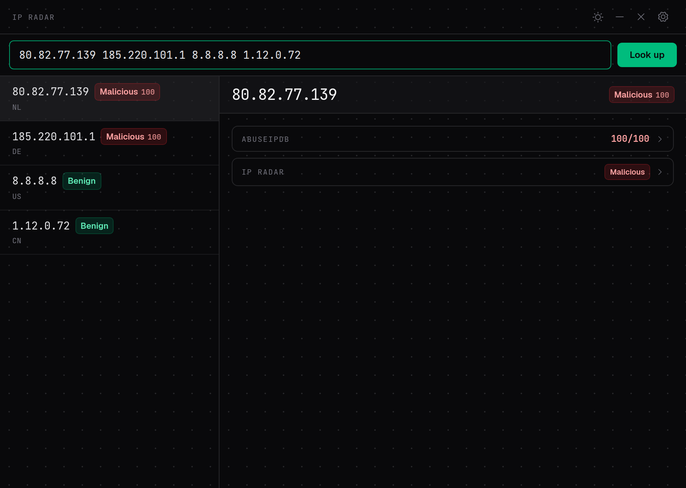
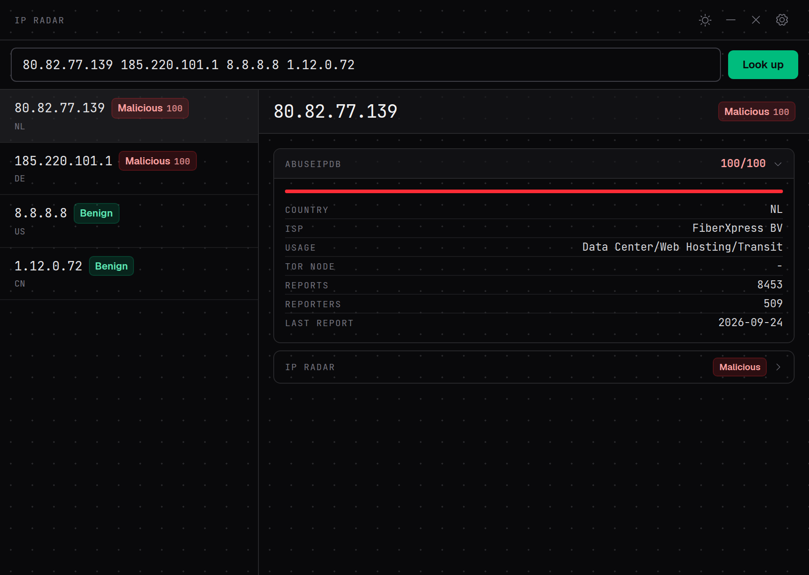

# IP Radar Desktop

<p align="center">
  <a href="https://ipradar.huxiao0207.dpdns.org"></a>
</p>

[简体中文](#简体中文) | [English](#english)

<p align="center">
  
</p>

## 简体中文

**IP Radar 的官方桌面伴侣。** 托盘常驻,全局快捷键(`Ctrl/Cmd+Alt+I`)唤起 → 自动读取剪贴板中的 IP → 多源并行查询 → 弹窗展示完整画像。安全运维的贴身 IP 情报入口。

- **一键即查** —— 复制 IP 后按下快捷键,剪贴板中的 IP(单个或一批,上限可在设置中调整)直接出结果,无需粘贴确认
- **多源并列** —— 查询你自部署的 [IP Radar](https://github.com/steponeerror/ip-radar) server(verdict / 置信度 / geo / ASN / 分类证据),同时并列 [AbuseIPDB](https://www.abuseipdb.com/) 云端信誉;源互相隔离,一个挂了另一个照常
- **源可插拔** —— 新增查询源 = 在 `src/sources/` 加一个文件,零注册代码
- **多 IP 批量** —— 从日志/告警里复制的一串 IP 一次全查,紧凑列表点击展开详情,verdict 徽章一目了然
- **多平台** —— Linux / macOS / Windows 三平台构建,轻量(Tauri 2)

<p align="center">
  
</p>

### 安装

从 [Releases](../../releases) 下载对应平台安装包:

| 平台 | 包 | 首次运行 |
|---|---|---|
| Linux | `.deb` / `.AppImage` | 直接安装/运行 |
| macOS | `.dmg` | 未签名,首次运行需执行:`xattr -cr "/Applications/IP Radar Desktop.app"`(或右键 → 打开) |
| Windows | `.msi` / `.exe` | 未签名,SmartScreen 弹窗时点「更多信息 → 仍要运行」 |

### 配置

打开设置(窗口右上角齿轮):

- **Server URL** —— 指向你自部署的 ip-radar(默认 `http://127.0.0.1:8000`)
- **IP Radar API key** —— 新版 server 对跨源程序化查询要求 Bearer key:浏览器打开 `{serverUrl}/admin` → API Keys → 签发后粘贴到此处(旧版无鉴权 server 不填也可用)
- **AbuseIPDB API key** —— 免费额度 1000 次/天,在 [abuseipdb.com/account/api](https://www.abuseipdb.com/account/api) 申请
- 快捷键、单次最大查询数、语言、源开关、开机自启等均可在设置中调整

### 从源码构建

```bash
# Linux 依赖
sudo apt install libwebkit2gtk-4.1-dev build-essential curl wget file libxdo-dev libssl-dev libgtk-3-dev libayatana-appindicator3-dev librsvg2-dev

npm ci
npm run tauri build
```

### 许可

[AGPL-3.0](LICENSE)。主项目 [IP Radar](https://github.com/steponeerror/ip-radar) 同许可。

## English

**The official desktop companion for IP Radar.** Lives in your tray: press the global hotkey (`Ctrl/Cmd+Alt+I`) → IPs on your clipboard are read automatically → multiple sources are queried in parallel → a popup shows the full profile. Your at-hand IP intelligence entry for security operations.

- **Clipboard-to-verdict** — copy an IP (or a whole list, cap configurable), press the hotkey, results appear — no pasting, no confirmation
- **Parallel multi-source** — queries your self-hosted [IP Radar](https://github.com/steponeerror/ip-radar) server (verdict / confidence / geo / ASN / per-classification evidence) alongside [AbuseIPDB](https://www.abuseipdb.com/) cloud reputation; sources are isolated — one failing never blocks the other
- **Pluggable sources** — adding a query source is dropping one file into `src/sources/`, zero registration code
- **Batch lookups** — a list of IPs copied from logs or alerts is queried in one shot; compact rows expand into full detail views with verdict badges
- **Cross-platform** — Linux / macOS / Windows builds, lightweight (Tauri 2)

<p align="center">
  
</p>

### Install

Grab the package for your platform from [Releases](../../releases):

| Platform | Package | First run |
|---|---|---|
| Linux | `.deb` / `.AppImage` | install / run directly |
| macOS | `.dmg` | unsigned — first run: `xattr -cr "/Applications/IP Radar Desktop.app"` (or right-click → Open) |
| Windows | `.msi` / `.exe` | unsigned — on the SmartScreen prompt choose "More info → Run anyway" |

### Configuration

Open settings (gear icon, top right):

- **Server URL** — points to your self-hosted ip-radar (default `http://127.0.0.1:8000`)
- **IP Radar API key** — newer servers require a Bearer key for cross-origin programmatic queries: open `{serverUrl}/admin` in a browser → API Keys → issue one and paste it here (older servers without auth work with no key)
- **AbuseIPDB API key** — free tier is 1,000 checks/day, apply at [abuseipdb.com/account/api](https://www.abuseipdb.com/account/api)
- Hotkey, max IPs per query, language, source toggles and autostart are all configurable

### Build from source

```bash
# Linux deps
sudo apt install libwebkit2gtk-4.1-dev build-essential curl wget file libxdo-dev libssl-dev libgtk-3-dev libayatana-appindicator3-dev librsvg2-dev

npm ci
npm run tauri build
```

### License

[AGPL-3.0](LICENSE). Same license as the main project [IP Radar](https://github.com/steponeerror/ip-radar).
